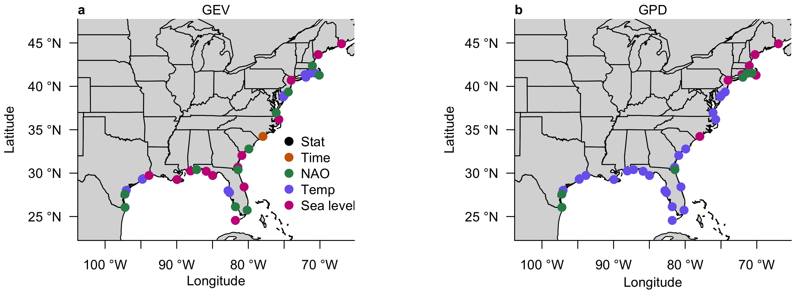

# Codes for the comparison of storm tide statistical modeling

## Directory structure

* `csv` - processed data, calibrated parameters, and prior distributions in CSV file form. The main versions are in RDS files in the `input_data` and `output` directories.
* `figures` - figures generated from the `analysis_driver.R` file
* `input_data` - tide gauge data and the data sets and projections for the covariate time series
* `output` - return level and calibrated parameter outputs
* `R` - all of the R code for processing the raw tide gauge data, calibrating the models, writing the output, analyzing the output and generating the plots

## Workflow

1. `install_packages.R` - install the relevant R packages that will be used later
1. `process_data.R` - process the raw tide gauge data for fitting the extreme value models
    1. `process_gev.R` - yields `processeddata_gev_[date].rds`
    1. `process_gpd.R` - yields `processeddata_gpd_[date].rds`; note that this processing takes a while (hours at least)
    1. `get_timeseries_covariates.R` - yields `covariates_[date].rds`
1. `calibration_driver.R` - need to set the file names in this script to make the processed data files and time series covariates file from the first couple steps.
    1. `trimmed_forcing.R` - used for matching up the time periods with tide gauge data to the time periods from the covariate data
    1. `fit_priors.R` - fit prior distributions to the set of long tide gauge stations around the world.
    1. `likelihood_gev.R` - the likelihood function, prior and posterior distribution functions and some other useful helper functions
    1. `likelihood_gpd.R` - the likelihood function, prior and posterior distribution functions and some other useful helper functions
    1. `parameter_setup_gev.R`
    1. `parameter_setup_gpd.R`
    1. to reproduce the results of the manuscript accompanying this work, need to run this twice - once with `calib_post = TRUE` (maximum a posteriori) and once with `calib_post = FALSE` (maximum likelihood)
    1. yields `optim_[covariate name]-[gev or gpd]-[date].rds`, output from maximum likelihood optimization for GEV or GPD parameters in each of the 8 potentially nonstationary models.
1. `analysis_driver.R` - make return level/period projections, calculate goodness-of-fit metrics and generate plots
    1. `best_models.R` - compute goodness-of-fit metrics
    1. `make_projections.R` - use the a posteriori statistical model parameters and the covariate time series forcing to estimate return levels and return periods
1. Epilogue
    1. `write_csv_data_and_priors.R` - read the RDS file with the processed data and prior distributions in it and translate these into CSV form for easier reading
    1. `write_csv_parameters.R` - write the calibrated sets of parameters to a CSV file

## Input data

### Tide gauge stations

* Only taking stations with at least 15 years of available data, from the University of Hawaii Sea Level Center database

### Covariate time series forcing

* time is simply the year
* global mean sea level is taken from [Wong and Keller (2017; doi: 10.1002/2017EF000607)](https://agupubs.onlinelibrary.wiley.com/doi/abs/10.1002/2017EF000607)) for projections and from [Church and White (2013; doi: 10.1007/s10712-011-9119-1)](https://link.springer.com/article/10.1007/s10712-011-9119-1) for hindcast
* global mean surface temperature is taken from the [National Centers for Environmental Information data portal](http://www.ncdc.noaa.gov/cag/) for hindcast and from the [CNRM-CM5 simulation (member 1) under Representative Concentration Pathway 8.5 (RCP8.5)](http://cmip-pcmdi.llnl.gov/cmip5/) for projections
* winter mean NAO index is taken from [Jones et al. (1997)](https://doi.org/10.1002/(SICI)1097-0088(19971115)17:13%3C1433::AID-JOC203%3E3.0.CO;2-P) for hindcast and, for projections, is computed from the [MPI-ECHAM5 sea-level pressure projection](http://www.mpimet.mpg.de/fileadmin/models/echam/mpi_report_349.pdf) under the Special Report on Emission Scenarios (SRES) A1B as part of the ENSEMBLES project for projections

If you want to use your own time series forcing,
* get it onto an annual mean time scale,
* normalize it to have a range of 0-1 for the hindcast period,
* and pop this into the `get_timeseries_covariates.R` script.
* You will probably also have to adjust some of the names and plot/axis legends in the plots in `analysis_driver.R`.

## Copyright

 This program is free software: you can redistribute it and/or modify it under the terms of the GNU General Public License as published by the Free Software Foundation, either version 3 of the License, or (at your option) any later version.

 This program is distributed in the hope that it will be useful, but WITHOUT ANY WARRANTY; without even the implied warranty of MERCHANTABILITY or FITNESS FOR A PARTICULAR PURPOSE.  See the GNU General Public License for more details.

 You should have received a copy of the GNU General Public License along with this program.  If not, see <https://www.gnu.org/licenses/>.

## Questions?

Please do not hesitate to contact me if there is anything I can help you with.

Sincerely, Tony Wong (aewsma@rit.edu)
